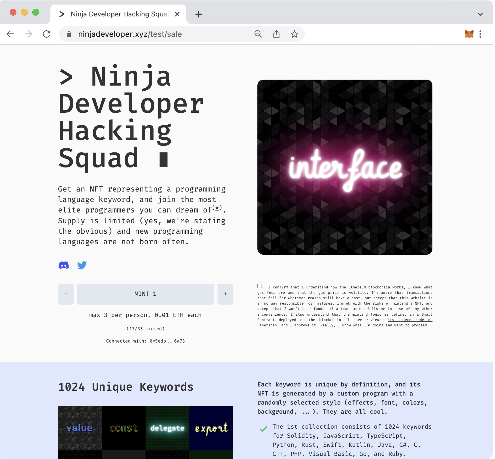

# Welcome to the Ninja Developer's website

This repository contains all the source code for the minting website for the [Ninja Developer Hacking Squad's NFT collection](https://ninjadeveloper.xyz).

[](https://ninjadeveloper.xyz)

The Ninja Developer Hacking Squad is an ironic website about the mythical "ninja developer", and its NFT collection comprises 1024 ERC-721 tokens on the Ethereum blockchain, representing keywords of the most used programming languages.

> NOTE: the code for the custom-made tools used to generate the NFT images and the metadata are also available in a separate repo under the [NinjaDevHS GitHub account](https://github.com/NinjaDevHS).

#### Features :rocket:

1. Support for multiple configuration files, to test different Smart Contracts on different networks (mainnet vs Rinkeby) through different urls (eg: `/index` vs `/test/index`).
2. Support for intro / presale / sale / soldout modes, to be switched on/off quickly on the index page, or to be tested on different urls (eg: `/intro`, `/presale`, `/sale` etc.).
3. Support for minting multiple NFTs per account, within a configurable range.
4. Support for a MerkleTree-based whitelist during the presale.
5. Support for MetaMask + WalletConnect. Works on both desktop browsers as well as on mobile devices with the MetaMask app or other wallet apps.
6. Display of NFTs minted by the connected account.
7. A webpage that displays all NFTs minted by all accounts (to be enabled post sold out), which allows holders to associate their keywords to urls of their choice. The operation is secured by signing a message with MetaMask, which is then validated on the backend before updating the url in the database.
8. A utility page (/tools/ownersextractor) to extract the list of accounts that own tokens on any ERC-721 Smart Contract. This will be useful if you want to know who's owning tokens of a popular collection for example, because you want to whitelist them for your own collection.

#### Tech Highlights and Infrastructure :computer:

1. React website
   - JavaScript
   - Responsive and clean layout made with Tailwind CSS
   - Web3.js and WalletConnect used to interact with Ethereum or Polygon
2. Node.js API endpoints connected to an Azure Cosmos DB database for storing the NFT=>url associations.
3. Deployed on [Netlify](https://www.netlify.com/) with a free plan + [Cosmos DB free tier](https://docs.microsoft.com/en-gb/azure/cosmos-db/free-tier).

#### Smart Contract :page_with_curl:

The Solidity Smart Contract is also part of this repo, since it was developed, tested, and integrated with the website in parallel. It supports the following features:
1. MerkleTree-based whitelist during presale.
2. Support for pausing/resuming minting at any time.
3. Blind-minting and subsequent reveal.
4. Configurable token reservation for staff on contract deployment.
5. OpenSea optimization to remove its listing fees during resales.

## How to deploy the Smart Contract and assets

The website's configuration you download from this repo points to a Smart Contract / collection that was deployed on the Ethereum's Rinkeby network. By the time you download it, all tokens might have been minted already, so it makes sense that one of the first things you do is to redeploy the contract and assets again, so that you can test the presale/sale modes from a clean state.

[This YouTube video](https://youtu.be/fzH7Gjadmj0?t=3910) shows the process step by step, and it's highly recommended (it's actually what originally inspired the very first basic version of our minting page).

> NOTE: if you prefer Polygon, rejoyce...everything in this project is compatible with it!

Once you've deployed the contract (the full source code is inside the `contracts` folder), take note of its Ethereum address and ABI code, because you need those in the website's configuration (also as explained in the video above).

> NOTE: if you're serious about Ethereum development, it's surely worth setting up a local dev node with [HardHat](https://hardhat.org/). However, the online Remix IDE is even simpler and very convenient, and it's good enough for some tests, especially if you use a pre-made Smart Contract that you want to deploy directly on the Rinkeby testnet.

## How to run the website locally

Before you can run the website, you need to make it point to the correct Smart Contract. Modify the json files inside the `src/configs` folder to change the settings for test and production (or just use the same for both initially, until you're ready to deploy to mainnet).

The names of the attributes in the config files are self-descriptive, but the most important things are:
- the `chain_id`, which is `1` for Ethereum mainnet, and `4` for Rinkeby. Refer to [Chainlist](https://chainlist.org/) for a full reference.
- the `address` where the Smart Contract was deployed at, relative to the chain_id network.
- the contract's `abi`, which you should also have retrieved when deploying the contract.
- the `infura_id`, which you take from the [Infura](https://infura.io/) dashboard after you sign up for a free account, and which is required for WalletConnect (you can ignore this if you only want to use MetaMask).
- the `whitelist_url` points to a json file that contains an array of whitelisted addresses for the presale mode; the url is relative to the `public` folder. You don't need this setting and the file is you'll go straight to sale mode.

Once that's all set up, open the src/index.js file, and see how different urls are configured to load the different modes with the different configuration files. The example below configures urls to test all the different modes under a `/test/` path, while it only enables the intro mode on the website's root path `/`.

```
...
<BrowserRouter>
   <Routes>
      <Route path="/" element={
         <Home config={config} mode="intro" />
      } />

      <Route path="/test" element={
         <Home config={config_test} mode="intro" />
      } />
      <Route path="/test/intro" element={
         <Home config={config_test} mode="intro" />
      } />
      <Route path="/test/sale" element={
         <Home config={config_test} mode="sale" />
      } />
      <Route path="/test/presale" element={
         <Home config={config_test} mode="presale" />
      } />
      <Route path="/test/soldout" element={
         <Home config={config_test} mode="soldout" />
      } />
      <Route path="/test/keywords" element={
         <AllKeywords config={config_test} />
      } />
      ...
   </Routes>
...
```

On your deployment, manually modify the `mode` attribute of the `/` path and redeploy the website when you want to switch from `intro` to `presale` to `sale` etc.

To finally launch the website locally, run the following from a Terminal window:

`npm install` (only for the first installation of the packages)

`yarn start` (or `npm run start` if you don't have Yarn installed)

If you modify any style in the pages, and use Tailwind CSS classes as we've done, also execute the following from a separate Terminal, which automatically rebuilds the CSS file with the Tailwind CLI any time you modify the source code:

`yarn buildcss`

#### Presale / whitelist mode
To enable the presale mode, you also need to set the `onlyWhitelist` flag to `true` on the Smart Contract, with the `setOnlyWhitelist` function from the Remix IDE.

But actually, just before you do that, you should set the whitelist's MerkleTree root value: get the value from the website's `/tools/merkletree` page after you copy-paste the list of whitelisted addresses into the textbox (this must be the same list you put into the whitelist json file pointed to by the `whitelist_url` config setting).

> NOTE: if you're unfamiliar with MerkleTrees and this strategy, definitely refer to [this article](https://medium.com/@ItsCuzzo/using-merkle-trees-for-nft-whitelists-523b58ada3f9) which does a great job at explaining everything.

#### Netlify and the backend API

This section is only needed for the "keywords" webpage, only available in the `soldout` mode, which shows all the keyword NFT images. The keyword images can optionally link to external urls, which are set by their owner through the same page. A little backend API is responsible for a couple of things:
1. Returning the list of all tokens and their links, for display purposes.
2. Associating a new destination url to a keyword, after verifying that the request comes from the rightful owner. The user signs a request on MetaMask, the signature is sent to the API endpoint, and the API checks that the signer is actually the owner of the token they're trying to modify, by checking the ownership directly on the blockchain in real-time (btw, this is what the Infura node is used for).

For #1, you need a file with all the metadata, `tokens.json`, which is generated by a tool available in the tools repo under the [NinjaDevHS GitHub account](https://github.com/NinjaDevHS).

For #2, an Azure Cosmos DB needs to be created on an Azure free tier. Refer to [this article](https://docs.microsoft.com/en-us/azure/cosmos-db/sql/sql-api-nodejs-get-started) for a step by step guide. We created a container named `tokens_test` (`tokens` for the production env) but you can use any other name, and a `/id` partition key. We used the remotely hosted real Cosmos DB also during the local development, but if you prefer you could use a [local Cosmos DB Emulator](https://docs.microsoft.com/en-us/azure/cosmos-db/local-emulator?tabs=ssl-netstd21) until you're ready to deploy locally (we don't think it's really worth it though, for a project of this size)

Once you have the Cosmos DB, you need to configure a few IDs and keys in a `.env` file. Use the template in `.env.local`, rename it to `.env` and fill in the blanks. Remember that this file is not supposed to be checked into the code repo though (which is why you won't find ours, and only find the template file).
In the same file you also need the same Smart Contract's address that was used in the frontend's config, and the Infura url.

> NOTE: the MY_* and MY_TEST_* configs in `.env` are the same things, but the first set is for production/mainnet while the latter is for the test/Rinkeby environment.

The API endpoints are run as [Netlify serverless Functions](https://www.netlify.com/products/functions/), and you need to install the [Netlify CLI](https://docs.netlify.com/cli/get-started/) to run them locally.

Once you're all set, open a Terminal and run:

`ntl dev`

This completely replaces the previous `yarn start`, and it will run the website on a different port, which should become `http://localhost:8888/` rather than `http://localhost:3000/`.

So if you complete this step, you only need to run `ntl dev` + `yarn buildcss` to have everything (the website's frontend + the website's API + the Tailwind CSS builder) running.

## How to deploy the website online

Deploying on Netlify, directly from a private GitHub repo, is free and so simple that it only takes a few minutes. See a tutorial [here](https://www.youtube.com/watch?v=4h8B080Mv4U).

> Normally you'd run `yarn build` or `npm run build` on your machine to build a production-ready version of the site, and manually upload it somewhere...but Netlify does all that for you automatically, every time you commit any change to your configured GitHub repo.

Associating your own custom domain to an account is also free. It's part of the initial setup wizard and you shouldn't need any further docs...but if you do, [here it is](https://docs.netlify.com/domains-https/custom-domains/).

Finally, while a `.env` file is used for the API config on a local installation, you'll probably want to define the env variables directly on Netlify for the remote installation. Why and How is explained on [their blog](https://www.netlify.com/blog/2021/07/05/easy-access-environment-variables/). Just manually duplicate all the key-value pairs you have in the `.env` file inside of the Netlify's config page (make sure you use the same names and values).

> NOTE: unless you used the Azure Cosmos DB Emulator on the local env, you should be all set with that already. If not, refer to the previous section.

## Contact and Follow Us
[Twitter](https://twitter.com/NinjaDevHS)

## Support
[Discord](https://discord.gg/E7wTVDFwPg): you're welcome to report bugs and ask questions about this project...as well as share and discuss ideas, and talk about other web3 and programming topic in general!

Oh, and we have to admit...we'd really appreciate if you could "star" this on GitHub :P

## Other Projects
[OneLauncher](https://onelauncher.com/): a wallet explorer, that shows all tokens together with their metadata, purchase price and current worth.

## DISCLAIMER: USE AT YOUR OWN RISK

This source code is shared for educational purposes only. There is no guarantee that it's bug-free...actually, that's very unlikely. Please make sure you carefully review, understand, and test the code before using it in any production system. Needless to say...but we say it anyway...we take no responsibility for any issue with the code; use it at your own risk.